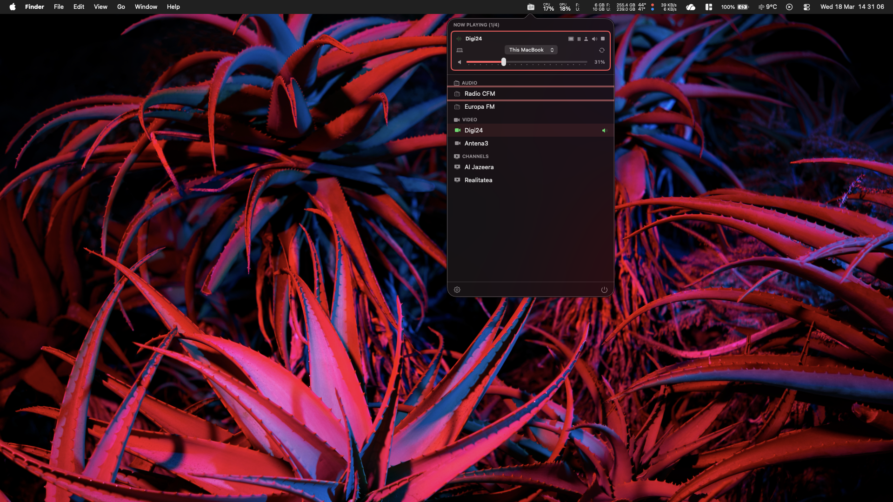
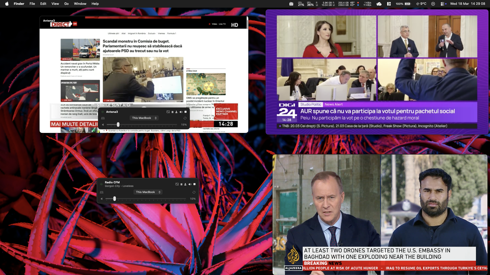
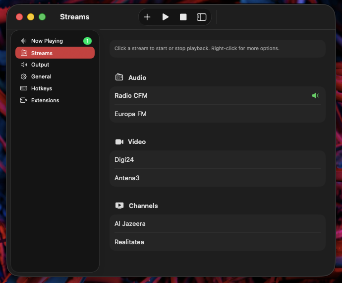

<p align="center">
  
</p>

<h1 align="center">Radio</h1>

<p align="center">
  <a href="https://github.com/pom11/Radio"></a>
  <a href="https://github.com/pom11/Radio"></a>
  <a href="https://github.com/pom11/Radio"></a>
  <a href="LICENSE"></a>
  <a href="https://github.com/pom11/homebrew-tap"></a>
</p>

<p align="center">
A lightweight macOS menu bar app for internet radio and live streams.<br>
Plays audio streams, YouTube / Twitch / Kick channels, DASH/HLS video, and more — locally, via AirPlay, or on Chromecast.
</p>

<p align="center">
  
</p>

Built with Swift and SwiftUI. No Electron. No frameworks. Just a native menu bar app that stays out of your way.

## Screenshots

<p align="center">
  
</p>
<p align="center"><em>Multi-stream — 4 simultaneous video streams with independent floating windows</em></p>

<p align="center">
  
</p>
<p align="center"><em>Settings — stream library with audio, video, and channel categories</em></p>

## Why

I spend most of my day in the terminal or browser — coding, debugging, reading docs. There's always music or a news stream running somewhere: a browser tab playing a YouTube channel, an Icecast stream in another tab, sometimes casting to the TV in the background.

I wanted one lightweight app to manage all of that. No browser tabs eating RAM, no Electron wrappers, no subscriptions. Just a menu bar icon that plays my streams, casts to my Chromecast, and gets out of the way.

So I built Radio. You save streams from any webpage with the browser extension, then play them in the background, watch them in a floating window, or cast them to a nearby device. It supports multi-stream with separate controls — so you can watch a YouTube channel on your laptop while streaming the news to the TV next to you.

Contributions are welcome — whether it's new features, bug fixes, or stream format support. Built with Swift, SwiftUI, and [OpenClaw](https://github.com/openclaw/openclaw).

## Features

- **Multi-stream playback** — play multiple streams simultaneously with independent controls
- **Universal URL handling** — paste any stream URL, type and name are auto-detected
- **Audio streams** — Icecast, Shoutcast, MP3, AAC, OGG
- **Live platforms** —  YouTube &nbsp;  Twitch &nbsp;  Kick — channels, live streams, and VODs (auto-resolves via yt-dlp)
- **HLS / DASH** — live and VOD video streams, including Google DAI wrapped streams
- **Multiple outputs** — local speakers, AirPlay, Bluetooth, USB, or Chromecast — per stream
- **Chromecast casting** — play/pause, volume, HLS-to-MP4 proxy for basic Chromecasts
- **Native HTTP header injection** — streams requiring custom headers play without overhead; automatic proxy fallback
- **Unified player controls** — same control card everywhere: menu bar, video window, settings
- **Floating video window** — resizable picture-in-picture with hover controls, 16:9 aspect lock
- **Global hotkeys** — configurable shortcuts that work system-wide
- **Spotlight & Siri** — 14 intents: stream, stop, volume, mute, pause, solo, video controls
- **Browser extension** — detect streams on any webpage and add them with one click
- **URL scheme** — other apps can control Radio via `radio://` URLs
- **Launch at login** — optional, toggleable in settings

## Install

### Homebrew (recommended)

```sh
brew install --cask pom11/tap/radio
```

Signed and notarized — no Gatekeeper warnings, no `xattr` workarounds. Installs directly to `/Applications`.

### From source

```sh
git clone https://github.com/pom11/Radio.git && cd Radio && make setup && make install
```

Requires Xcode Command Line Tools, ffmpeg, yt-dlp, and streamlink (`make setup` installs these via Homebrew).

### Requirements

- macOS 14.0+ (Sonoma or later)

## Usage

### Getting started

1. Launch Radio — it appears as an icon in the menu bar
2. Click the icon to open the popover
3. Open **Settings** (gear icon) to add your first stream

### Adding streams

**From settings:** click Add Stream, paste a URL — the type and name are auto-detected.

**From the browser extension:** visit any page with audio/video, click the Radio extension icon, and click a detected stream to add it.

**Quick Play** lets you play any URL without saving it to your streams list.

### Playback

Click any stream in the popover to start playing. Click again to stop.

Each stream gets its own control card with play/pause, mute, volume, device picker, and stop. When playing multiple streams, tap a card to make it the active target for hotkeys. The active card is expanded; inactive cards collapse to save space.

For video streams, click the rectangle icon to open a floating video window. Controls appear on hover and auto-hide after 2 seconds. Keyboard shortcuts work when the window is focused:

| Key | Action |
|-----|--------|
| Space | Play / pause |
| M | Mute / unmute |
| F | Toggle always-on-top |
| Tab | Cycle active player |
| Up / Down | Volume up / down |

### Output devices

Each stream has its own device picker — switch between MacBook speakers, AirPlay, Bluetooth, USB, or Chromecast independently. The scan button next to the picker discovers new Chromecast devices on your network.

When casting to Chromecast, an HLS toggle appears for basic Chromecasts that don't support HLS natively. The proxy runs ffmpeg locally to remux the stream to MP4.

### Hotkeys

All hotkeys are configurable in Settings > Hotkeys:

| Hotkey | Description |
|--------|-------------|
| Toggle Radio | Show/hide the popover |
| Play / Pause | Toggle stream playback |
| Volume Up / Down | Adjust volume by 10% |
| Mute / Unmute | Toggle mute |
| Solo Toggle | Mute all other streams |
| Cycle Player | Switch active player |
| Toggle Video | Show/hide the video window |
| Video Float | Toggle always-on-top |
| Toggle All Windows | Show/hide all video windows |

Hotkeys automatically route through Chromecast when the active player is casting.

### Siri & Spotlight

Radio registers 14 App Intents — 10 with Siri phrases, all available in the Shortcuts app.

| Command | Siri phrase |
|---------|-------------|
| **Stream** | "Stream \[stream name\] on Radio" |
| **Stop stream** | "Stop \[stream name\] on Radio" |
| **Stop all** | "Stop Radio" |
| **Now playing** | "What's playing on Radio" |
| **Volume up** | "Volume up on Radio" / "Radio louder" |
| **Volume down** | "Volume down on Radio" / "Radio quieter" |
| **Mute** | "Mute Radio" |
| **Unmute** | "Unmute Radio" |
| **Pause** | "Pause Radio" |
| **Resume** | "Resume Radio" |

Additional intents available in the Shortcuts app: **Solo**, **Show**, **Hide**, **Fullscreen** — each targeting a specific stream by name.

### URL scheme

```
radio://add?url=https://stream.example.com/live&name=My%20Station
radio://play?url=https://stream.example.com/live
```

## Browser Extension

Detects audio/video streams on any webpage. Works with Chrome, Edge, Brave, Arc, Vivaldi, Firefox, and Safari.

**Chrome / Edge / Brave / Arc / Vivaldi:** In Radio settings, find Browser Extension and click Install next to your browser. Or manually load the `extension/` folder as an unpacked extension.

**Firefox:** Open `about:debugging#/runtime/this-firefox`, click Load Temporary Add-on, select `extension/manifest.json`.

**Safari:** Run the converter and build the Xcode project:

```sh
xcrun safari-web-extension-converter extension/ \
  --app-name "Radio Extension" \
  --bundle-identifier ro.pom.radio.extension
```

## Supported URL types

| URL type | Local | AirPlay | Chromecast |
|----------|:-----:|:-------:|:----------:|
| Icecast / Shoutcast | yes | yes | yes |
|  YouTube video / live / channel | yes | yes | yes |
|  Twitch channel / live | yes | yes | yes |
|  Kick channel / live | yes | yes | yes |
| HLS (.m3u8) | yes | yes | yes (via proxy) |
| DASH (.mpd) | via streamlink | via streamlink | yes |
| Direct media (.mp3, .mp4) | yes | yes | yes |
| Google DAI streams | yes | yes | yes (via proxy) |

## Config

Streams are stored in `~/.config/radio/streams.json`. You can edit this file directly — Radio picks up changes when you click Reload in settings.

## Project structure

```
Sources/
  RadioApp.swift            App entry point, menu bar, status item
  StreamPlayer.swift        AVPlayer playback, reconnect, header injection
  PlayerManager.swift       Multi-stream coordinator, active player
  PlayerControlCard.swift   Unified player controls (popover/overlay/settings)
  OutputManager.swift       Device discovery, AirPlay, Chromecast routing
  CastController.swift      Chromecast DIAL/CAST protocol
  CastProxy.swift           Local HLS-to-MP4 proxy for Chromecast
  YouTubeLoungeAPI.swift    YouTube Lounge API for cast control
  StreamProbe.swift         URL resolution, stream type detection
  URLResolver.swift         yt-dlp / streamlink integration
  HeaderProxy.swift         HTTP header injection proxy
  MenuBarPopover.swift      Menu bar popover UI
  RadioView.swift           Settings window UI
  StreamStore.swift         Stream model, JSON persistence
  HotKeyManager.swift       Global hotkey registration (Carbon)
  RadioIntents.swift        Siri & Spotlight intents (14 intents)
  VideoWindow.swift         Floating video window (NSPanel + SwiftUI)
extension/                  Browser extension (Chrome/Firefox/Safari)
```

## Support the project

If Radio saves you from browser tab hell, consider buying me some electricity:

| Currency | Address |
|----------|---------|
| **ETH** | `0x77B5C61EBd7933DC20F37fDf6D4A7725C4872703` |
| **BTC** | `bc1qxl2p5u3kmyyftrtysd2lgcs2hfth0epfdsu7ug` |
| **BNB** | `0x77B5C61EBd7933DC20F37fDf6D4A7725C4872703` |

## License

MIT
